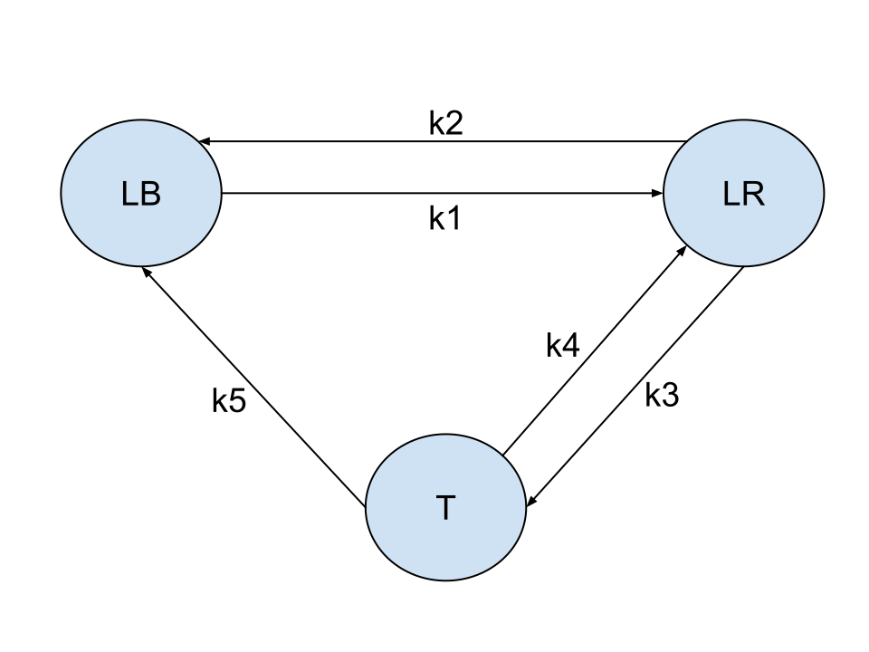

# Stochastic Simulation of Telomere Dynamics

This repository contains a Python implementation of a **stochastic telomere dynamics model** using the **Gillespie algorithm**.  
The code simulates the transitions between three telomeric states during multiple embryonic stem cell (ESC) cycles:

- **LB**: Linear blunt telomeres  
- **LR**: Linear resected telomeres  
- **T**: Telomere loops (t-loops)  

The model explores how telomeres fluctuate between these states depending on cell cycle phase (G1, S, G2/M) and stochastic reaction events.  

---

## Features

- **Gillespie simulation** of telomere state transitions.  
- Incorporates **cell cycle dynamics** (G1, S, G2/M).  
- Models **rare non-equal divisions** at cell cycle checkpoints.  
- Runs **multiple independent simulations** (representing different cells).  
- Outputs **mean dynamics and variability** across simulated populations.  
- Generates clear **plots with shaded error bars**, cell cycle phase markers, and division events.

---

## Model Overview

### States
1. **LB (Linear blunt telomeres)**  
2. **LR (Linear resected telomeres)**  
3. **T (Telomere-loops)**  

### Reactions (with biological interpretation)
1. `LB → LR` (APOLLO activity, resection)  
2. `LR → LB` (breaks or nucleases)  
3. `LR → T` (t-loop formation)  
4. `T → LB` (t-circle, breakage)  
5. `T → LR` (t-loop opening, C-circle formation)  



### Cell Cycle Parameters
- **G1**: ~1 hour  
- **S**: ~5 hours  
- **G2/M**: ~2 hours  
- **Total cycle length**: 8 hours  

Different (arbitrary) reaction rate constants are applied in each phase to reflect biological conditions.  

---

## Installation

Clone the repository and install required dependencies:

```bash
git clone https://github.com/joeydufourd/telomere-dynamics-gillespie.git
